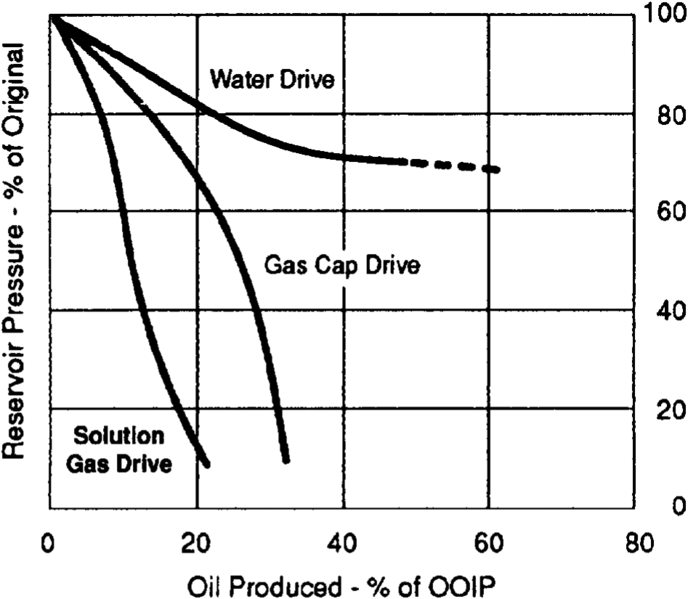
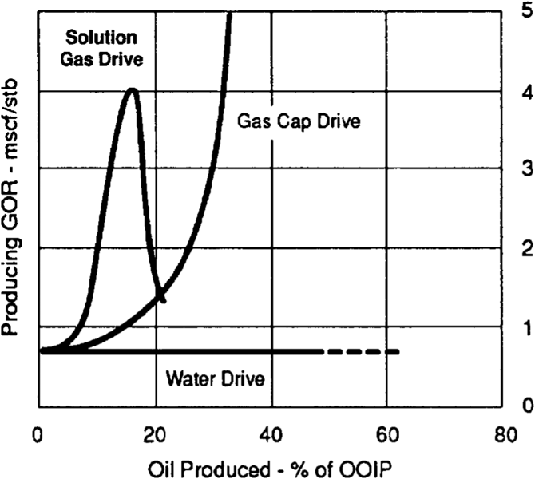
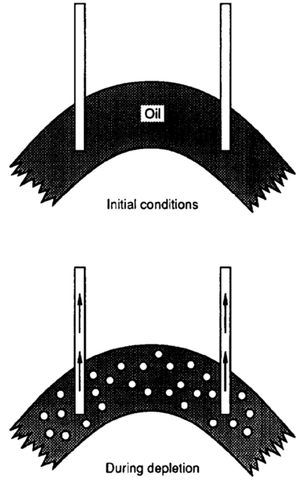
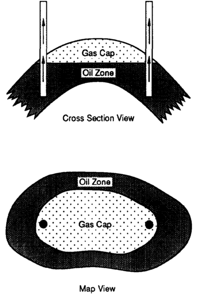
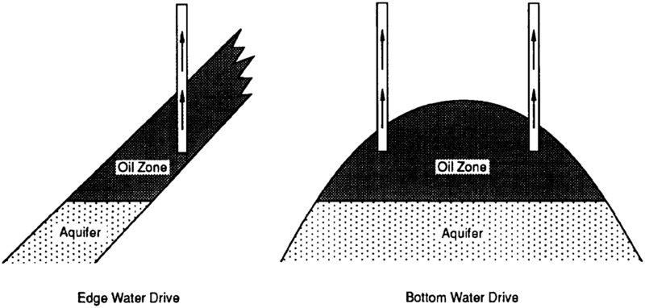
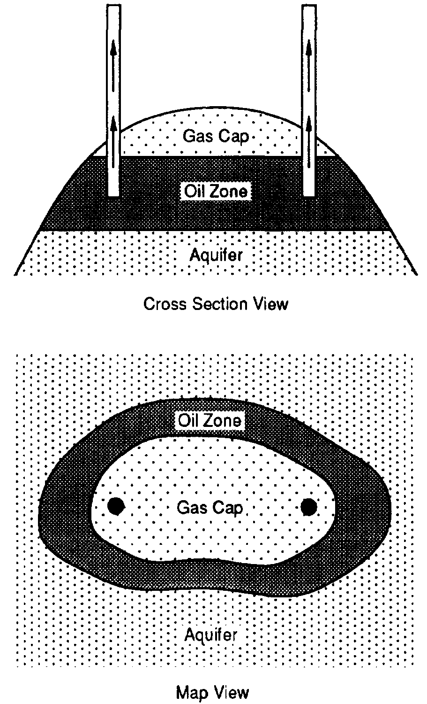
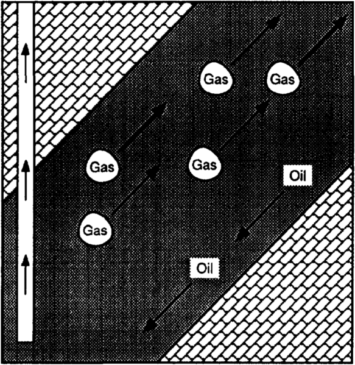

# AAPG - Drive Mechanisms and Recovery

From [AAPG Wiki](https://wiki.aapg.org/Drive_mechanisms_and_recovery)

The natural energy of a reservoir can be used to move oil and gas toward the wellbore. Used in such a fashion, these sources of energy are called *drive mechanisms*. Early determination and characterization of the drive mechanism(s) present within a reservoir may allow a greater ultimate recovery of hydrocarbons. Drive mechanisms are determined by the analysis of historical production data, primarily reservoir pressure data and fluid production ratios.

The three primary oil reservoir drive mechanisms are [solution gas drive](https://wiki.aapg.org/Drive_mechanisms_and_recovery#Solution_gas_drive "Drive mechanisms and recovery"), [gas cap drive](https://wiki.aapg.org/Drive_mechanisms_and_recovery#Gas_cap_drive "Drive mechanisms and recovery"), and [water drive](https://wiki.aapg.org/Drive_mechanisms_and_recovery#Water_drive "Drive mechanisms and recovery").[[1]](https://wiki.aapg.org/Drive_mechanisms_and_recovery#cite_note-pt10r5-1) Reservoir pressure trends and producing gas-oil ratio trends of these three drive mechanisms are shown in **Figures 1** and **2**, respectively. A *combination* or *mixed drive* occurs when two or more of the primary drive mechanisms are present in the same reservoir. A combination drive may also occur when one or more of the primary drive mechanisms are assisted by *gravity drainage*. Table 1 shows the energy sources and ultimate recovery ranges of the major drive mechanisms.

**Figure 1** Reservoir pressure trends by drive mechanism.

**Figure 2** Producing gas-oil ratio trends by drive mechanism.

**Table 1** Ultimate recovery ranges by drive mechanism

| Drive Mechanism    | Energy Source                              | Recovery (% OOIP)  |
| ------------------ | ------------------------------------------ | ------------------ |
| Solution gas drive | Evolved solution gas expansion             | 5-30               |
| Gas cap drive      | Gas cap and evolved solution gas expansion | 20-40              |
| Water drive        | Aquifer expansion                          | 35-75              |
| Gravity drainage   | Gravity                                    | 5-30 (incremental) |

## Solution gas drive

In a solution (or dissolved) gas drive reservoir, the oil-bearing rock is completely surrounded by impermeable barriers. As the reservoir pressure drops during production, expansion of the oil and its dissolved gas provides most of the reservoir's drive energy ([Figure 3](https://wiki.aapg.org/File:Drive-mechanisms-and-recovery_fig3.png "File:Drive-mechanisms-and-recovery fig3.png")). Additional energy is obtained from the expansion of the rock and its associated water.

Depending on its discovery pressure, a solution gas drive reservoir can be initially either [undersaturated](https://wiki.aapg.org/index.php?title=Undersaturated&action=edit&redlink=1 "Undersaturated (page does not exist)") or [saturated](https://wiki.aapg.org/index.php?title=Saturated&action=edit&redlink=1 "Saturated (page does not exist)").[[2]](https://wiki.aapg.org/Drive_mechanisms_and_recovery#cite_note-pt10r25-2) In an undersaturated reservoir, the reservoir pressure is greater than the bubblepoint of the oil. No free gas exists in the reservoir while the pressure remains above the bubblepoint. The reservoir drive energy is provided only by the limited expansion of the oil, rock, and water. In a saturated reservoir, the reservoir pressure is at the bubblepoint. As soon as oil is produced, the pressure drops and bubbles of solution gas form in the reservoir. This solution gas liberation causes the oil to shrink, but the oil shrinkage is more than offset by solution gas expansion, the primary source of reservoir drive energy below the bubblepoint.

## Production trends

**Figure 3** Solution gas drive reservoir.

Solution gas drive reservoirs show characteristic changes in reservoir pressure, producing gas-oil ratio, and oil and water production rates during the life of the reservoir. If the reservoir is initially undersaturated, the reservoir pressure falls quickly during oil production because of the small compressibilities of oil, water, and rock. Pressure drops of several hundred pounds per square inch can easily occur over a matter of months. Because the only gas produced is that which evolves from the produced oil in the wellbore, the gas-oil ratio (GOR) remains constant until the reservoir reaches the bubblepoint.

Once reservoir pressure reaches the bubblepoint pressure or if the reservoir was initially saturated, the reservoir pressure declines less quickly due to the large compressibility of the gas bubbles forming in the reservoir. The producing GOR rises quickly as the bubbles link up and begin to flow and can increase to as much as ten times the initial GOR. If reservoir pressure continues to fall, the producing GOR will eventually drop as the gas expands less and less as it flows up the wellbore.

Oil production rates fall quickly once the producing GOR begins to rise. Wells must be placed on [artificial lift](https://wiki.aapg.org/Artificial_lift "Artificial lift") early in their life. Initially, little or no water is produced. As reservoir pressure drops, a small amount of water may be produced as the interstitial water saturation expands and exceeds the critical value required for flow.

### Recovery

Oil recovery from solution gas drive reservoirs is usually low, ranging from 5 to 30% of the original oil in place (OOIP) (see Table 1). Typically less than 5% of the OOIP is recovered above the bubblepoint. In general, the better solution gas drive recoveries are obtained in reservoirs with relatively low oil viscosities and fairly homogeneous rock properties. Recovery can sometimes be improved with completion strategies that conserve reservoir energy by minimizing the producing GOR.

## Gas cap drive

In a gas cap drive reservoir, the primary source of reservoir energy is an initial gas cap, which expands as the reservoir pressure drops ([Figure 4](https://wiki.aapg.org/File:Drive-mechanisms-and-recovery_fig4.png "File:Drive-mechanisms-and-recovery fig4.png")). Additional energy is provided by the expansion of solution gas released from the oil. Less significant drive contributions are provided by the expansion of the rock and its associated water.

**Figure 4** Gas cap drive reservoir.

### Production trends

Gas cap expansion causes reservoir pressure to fall more slowly in a gas cap drive reservoir than in one producing in a solution gas drive. The rate of pressure decline is closely tied to the relative size of the gas cap, with larger gas caps resulting in a more gradual pressure decline as oil is produced.

Early in the life of a gas cap drive reservoir, the GOR rises slowly because the higher reservoir pressure keeps more gas in solution in the oil. Later, the GOR increases dramatically as the expanding gas cap reaches the highest wells on structure. The GOR continues to climb as the [gas-oil contact](http://www.glossary.oilfield.slb.com/en/Terms.aspx?LookIn=term%20name&filter=gas-oil%20contact) moves farther down structure and gas cap gas production increases. Oil production rates fall less quickly than in a solution gas drive reservoir due to the slower decline in reservoir pressure. [Artificial lift](https://wiki.aapg.org/Artificial_lift "Artificial lift") may not be required as early in the field's life since wells tend to have longer flowing lives. As in a solution gas drive, little or no water is produced.

### Recovery

Oil recovery from gas cap drive reservoirs typically ranges from 20 to 40% of the original oil in place. The actual recovery obtained depends on the size of the initial gas cap, the structural geometry of the reservoir, and the way the field is managed.

Gas cap drive recovery increases with the size of the initial gas cap if gas cap gas production can be minimized. This is done most easily in steeply dipping reservoirs or those with thick oil columns which allow the wells to be perforated as far as possible below the gas-oil contact. Recovery can also be improved by shutting-in wells when they begin to produce large amounts of gas cap gas. In addition, the produced gas may be returned to the gas cap using gas injection wells located high on structure.

## Water drive

In a water drive reservoir, the oil zone is in communication with an aquifer that provides the bulk of the reservoir's drive energy. As oil is produced, the water in the aquifer expands and moves into the reservoir, displacing oil. Depending on the aquifer's strength, additional energy may be provided by solution gas expansion. Much less significant contributions are provided by the expansion of the reservoir rock and its associated water.

The geometry of the aquifer determines whether it is a *bottom water* or an *edge water* drive ([Figure 5](https://wiki.aapg.org/File:Drive-mechanisms-and-recovery_fig5.png "File:Drive-mechanisms-and-recovery fig5.png")). In a bottom water drive, the aquifer is present below the entire reservoir and water influx moves vertically upward into the oil zone. In an edge water drive, the aquifer is located on the flanks of the reservoir and the water moves upward along the reservoir [dip](https://wiki.aapg.org/Dip "Dip").

**Figure 5** Edge water versus bottom water drive reservoirs.

### Production trends

In a water drive, the reservoir pressure response to production depends on the size and [permeability](https://wiki.aapg.org/Permeability "Permeability") of the aquifer and the rate at which the reservoir is produced[[3]](https://wiki.aapg.org/Drive_mechanisms_and_recovery#cite_note-pt10r10-3). If the reservoir is produced at a low rate, the aquifer is able to replace the fluid volumes produced and reservoir pressure remains fairly constant. At high production rates, the aquifer is unable to keep up with withdrawals and reservoir pressure drops. If the rate is then reduced to a low level, reservoir pressure will rise. The magnitude of “high” and “low” production rates for a particular water drive reservoir are determined by the size and permeability of its associated aquifer.

In a strong water drive reservoir, the producing GOR remains fairly constant, reflecting the stable reservoir pressure. However, if the aquifer is unable to maintain reservoir pressure, the producing GOR will rise accordingly.

Oil rates remain high under strong water drive until water breaks through in the producing wells. Water production usually occurs early in the field life of down structure wells, and the *water-oil ratio (WOR)* continues to increase with time as the [oil-water contact](http://www.glossary.oilfield.slb.com/en/Terms.aspx?LookIn=term%20name&filter=oil-water%20contact) moves upward. Gas lift may be required for high water cut wells to continue to flow.

### Recovery

Oil recovery from water drive reservoirs typically ranges from 35 to 75% of the original oil in place. The actual recovery obtained depends on the strength of the aquifer, the sweep efficiency of the encroaching water, and the way the field is managed.

Water drive recovery increases with the strength of the aquifer if water production can be minimized. As with gas cap drive reservoirs, this is done most easily in reservoir geometries that allow wells to be perforated a considerable distance from the fluid contact.

Water drive recovery also depends on the aquifer's sweep efficiency. *Sweep efficiency* is a measure of how effectively the encroaching water displaces oil. Higher sweep efficiencies and oil recoveries occur when the [viscosity](https://wiki.aapg.org/Viscosity "Viscosity") of the oil is low compared to that of the water and oil flows more easily than the encroaching water. Water drive reservoirs with high viscosity crudes have lower sweep efficiencies and oil recoveries because the water tends to move ahead of or “finger” through the oil, leaving behind unswept oil.

Water drive recovery can be improved by balancing production rates across the field so that the oil-water contact moves up as uniformly as possible. Since water drive is usually more efficient than solution gas drive, in some cases it is possible to increase recovery by producing the reservoir at a rate low enough that the aquifer is able to maintain a high reservoir pressure.

## Combination drive

**Figure 6** Combination drive reservoir.

Most oil reservoirs produce under the influence of two or more reservoir drive mechanisms, referred to collectively as a combination drive. A common example is an oil reservoir with an initial gas cap and an active water drive ([Figure 6].

### Production trends

The production trends of a combination drive reservoir reflect the characteristics of the dominant drive mechanism. A reservoir with a small initial gas cap and a weak water drive will behave in a way similar to a solution gas drive reservoir, with rapidly decreasing reservoir pressure and rising GORs. Likewise, a reservoir with a large gas cap and a strong water drive may show very little decline in reservoir pressure while exhibiting steadily increasing GORs and WORs. Evaluation of these production trends is the primary method a reservoir engineer has for determining the drive mechanisms active in a reservoir.

### Recovery

The ultimate recovery obtained from a combination drive reservoir is a function of the drive mechanisms active in the reservoir. The recovery may be high or low depending on whether displacement or depletion drive mechanisms dominate. Water drive and gas cap expansion are both displacement type drive mechanisms and have relatively high recoveries. Solution gas drive is a depletion type drive and is relatively inefficient.

Recovery from a combination drive reservoir can often be improved by minimizing the effect of depletion drive mechanisms by substituting or augmenting more efficient ones through production rate management or fluid injection. To do this, the drive mechanisms active in a reservoir must be identified early in its life.

## Gravity drainage

**Figure 7** Fluid segregation by gravity damage.

Gravity drainage, or gravity segregation, is the tendency of oil, gas, and water to segregate in a reservoir during production due to their differing densities ([Figure 7](https://wiki.aapg.org/File:Drive-mechanisms-and-recovery_fig7.png "File:Drive-mechanisms-and-recovery fig7.png")). As a secondary drive mechanism, gravity drainage occurs only in combination with one or more of the primary oil reservoir drive mechanisms.

Conditions conducive to gravity drainage include thick reservoirs with high vertical permeabilities or thin reservoirs with steep dips. In a solution gas drive reservoir perforated down dip, gravity drainage can cause released solution gas to migrate upward and oil to flow downward, conserving reservoir energy and increasing recovery to near that of a water drive.

The rate of oil gravity drainage in the reservoir is usually low compared to field production rates. Over time, however, gravity drainage can be extremely efficient and recoveries higher than any of the primary drive mechanisms are possible.

## See also

- [Enhanced oil recovery](https://wiki.aapg.org/Enhanced_oil_recovery "Enhanced oil recovery")
- [Reservoir modeling for simulation purposes](https://wiki.aapg.org/Reservoir_modeling_for_simulation_purposes "Reservoir modeling for simulation purposes")
- [Reserves estimation](https://wiki.aapg.org/Reserves_estimation "Reserves estimation")
- [Waterflooding](https://wiki.aapg.org/Waterflooding "Waterflooding")
- [Fluid flow fundamentals](https://wiki.aapg.org/Fluid_flow_fundamentals "Fluid flow fundamentals")
- [Conducting a reservoir simulation study: an overview](https://wiki.aapg.org/Conducting_a_reservoir_simulation_study:_an_overview "Conducting a reservoir simulation study: an overview")
- [Introduction to reservoir engineering methods](https://wiki.aapg.org/Introduction_to_reservoir_engineering_methods "Introduction to reservoir engineering methods")
- [Petroleum reservoir fluid properties](https://wiki.aapg.org/Petroleum_reservoir_fluid_properties "Petroleum reservoir fluid properties")

## References

1. Clark, N. J., 1969, Elements of petroleum reservoirs: Dallas, TX, Society of Petroleum Engineers, AIME, p. 66–84.
2. Odeh, A. S., 1986, Reservoir fluid flow and natural drive mechanisms, in IHRDC Video Library for Exploration and Production Specialists, Manual for Module PE502: Boston, MA, IHRDC, p. 69–120.
3. Dake, L. P., 1978, Fundamentals of Reservoir Engineering: The Netherlands, Elsevier Science Publishers, p. 79–102.
