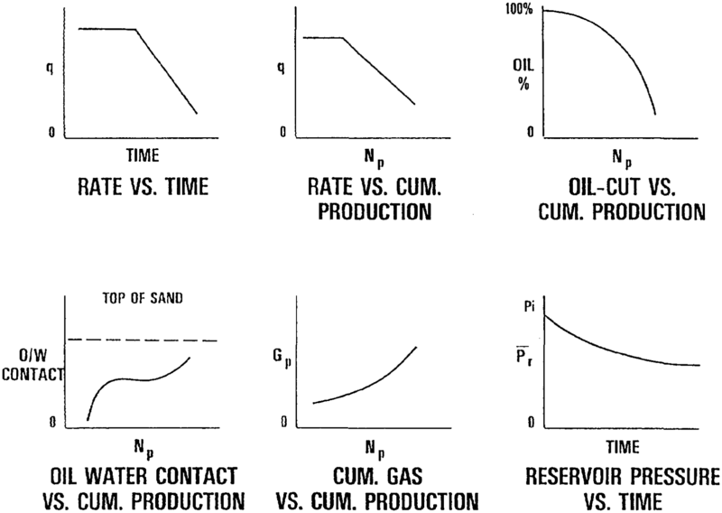
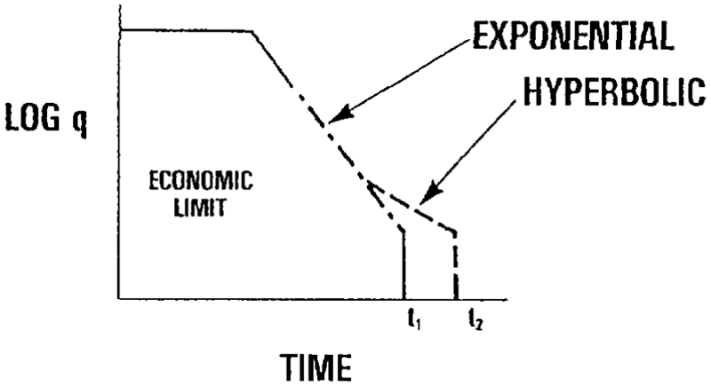
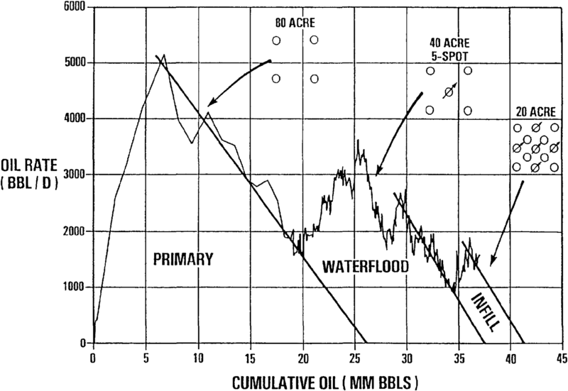

# AAPG - Reserves Estimation

Resource: [Reserves estimation - AAPG Wiki](https://wiki.aapg.org/Reserves_estimation)

## 

## Introduction

To better understand reserves estimation, a few important terms require definition. *Original oil in place (OOIP)* and *original gas in place (OGIP)* refer to the total volume of hydrocarbon stored in a reservoir prior to production. *Reserves* or *recoverable reserves* are the volume of hydrocarbons that can be profitably extracted from a reservoir using existing technology. *Resources* are reserves plus all other hydrocarbons that may eventually become producible; this includes known oil and gas deposits present that cannot be technologically or economically recovered (OOIP and OGIP) as well as other undiscovered potential reserves.

Estimating hydrocarbon reserves is a complex process that involves integrating geological and engineering data. Depending on the amount and quality of data available, one or more of the following methods may be used to estimate reserves:

- Volumetric
- Material balance
- Production history
- Analogy

These methods are summarized in Table 1.

**Table 1  Summary of methods used to derive hydrocarbon reserves**

| Method             | Application                                                                                                                                                                                          | Accuracy                                                                                                                                                |
| ------------------ | ---------------------------------------------------------------------------------------------------------------------------------------------------------------------------------------------------- | ------------------------------------------------------------------------------------------------------------------------------------------------------- |
| Volumetric         | OOIP, OGIP, recoverable reserves. Use early in life of field.                                                                                                                                        | Dependent on quality of reservoir description. Reserves estimates often high because this method does not consider problems of reservoir heterogeneity. |
| Material balance   | OOIP, OGIP (assumes adequate production history available), recoverable reserves (assumes OOIP and OGIP known). Use in a mature field with abundant geological, petrophysical, and engineering data. | Highly dependent on quality of reservoir description and amount of production data available. Reserve estimates variable.                               |
| Production history | Recoverable reserves. Use after a moderate amount of production data is available.                                                                                                                   | Dependent on amount of production history available. Reserve estimates tend to be realistic.                                                            |
| Analogy            | OOIP, OGIP, recoverable reserves. Use early in exploration and initial field development.                                                                                                            | Highly dependent on similarity of reservoir characteristics. Reserve estimates are often very general.                                                  |

## Volumetric Estimation

Volumetric estimates of OOIP and OGIP are based on a geological model that geometrically describes the volume of hydrocarbons in the reservoir. However, due mainly to gas evolving from the oil as pressure and temperature are decreased, oil at the surface occupies less space than it does in the subsurface. Conversely, gas at the surface occupies more space than it does in the subsurface because of expansion. This necessitates correcting subsurface volumes to standard units of volume measured at surface conditions.

One basic volumetric equation is

        $\Large OOIP = 7758 * A * h * \phi * (1 - S_w) / B_{oi}$

where 

- $OOIP$ = Original Oil In Place, in `STB or standard tank barrel`

- $7758$ = Conversionn factor from `acre-ft` to `bbl`

- $A$ = Reservoir Area from the map data in `acre`

- $h$ = Net Pay of the pay zone in `feet`

- $\phi$ = Porosity determined from Log or Core data in `decimal`

- $S_w$ = Satuation of Connate Water from log or core data in `decimal`

- $B_{oi}$ = Formation Volume Factor (FVF) for oil at initial conditions in `bbl/STB` 

Note: 

        A quick estimate of $B_{oi}$  is $B_{oi} = 1.05 + (N * 0.05)$, where N is the GOR (Gas-Oil Ratio) dividing 100. For example, in a well with a GOR of 1000 cuft/bbl,  then, $B_{oi} = 1.05 + (1000/100 * 0.05) = 1.55$

Another basic volumetric equation is:

        $\Large OGIP = 43560 * A * h * \phi * (1 - S_w) / B_{gi}$

where

- $OGIP$ = Original Gas In Place in `SCF or Standard cube feet`
- $43560$ = conversion factor from `acre-ft` to $ft^3$
- $B_{gi}$ = formation volume factor for gas at initial conditions in Reserve $ft^3/SCF$

$Recoverable\ Reserves$ are a fraction of the OOIP or OGIP and are dependent on the efficiency of the reservoir drive mechanism. The basic equation used to calculate recoverable oil reserves is

        $\Large Recoverable\ Oil\ Reserves\ (STB)\ =\ OOIP\ *\ RF$

where RF = recovery factor, which equals $RF_P$ + $RF_S$

The primary recovery factor, $RF_P$, is estimated from the type of drive mechanism as Table 2 below. 

**Table 2 Estimation of primary recovery factor***

| Drive Category  | Drive Mechanism | RFp (%) |
| --------------- | --------------- | ------- |
| Depletion Drive | Solution Gas    | 18-25   |
|                 | Expansion       | 2-5     |
| Gas Cap Drive   |                 | 20-40   |
| Water Drive     | Bottom          | 20-40   |
|                 | Edge            | 35-60   |
| Gravity Drive   |                 | 50-70   |

The secondary recovery factor, RFS, is determined by formula:

            $RF_S = E_D * E_A * E_V$

where

- $E_D$ = displacement efficiency
- $E_A$ = areal sweep efficiency
- $E_V$ = vertical sweep efficiency

These efficiency terms are influenced by such factors as residual oil saturation, relative permeability, reservoir heterogeneity, and operational limitations that govern reservoir production and management. Thus, it is difficult to calculate the recovery factor directly using these terms, and other methods, such as decline curves, are often applied.

The basic equation to calculate recoverable gas reserves is

    $\Large Recoverable\ Gas\ Reserves\ (SCF)\ =\ OGIP\ *\ RF$

In this case, the recovery factor (RF) is typically higher than for oil reservoirs; it is often near unity for dry gas reservoirs.

## Material Balance Estimation for Oil

The material balance technique mathematically models the reservoir as a tank. This method uses limiting assumptions and attempts to equilibrate changes in reservoir volume as a result of production. Aquifer support and gas cap expansion can be accounted for by using this method.

One general equation is

$Change\ in\ Pore\ Volume\ = Change\ in\ Oil\ Volume + Change\ in\ Free\ Gas\ Volume + Change\ in\ Water\ Volume$

where

- $\large Change\ in\ Pore\ Volume = \frac{NBoi}{(1-Swi)} c_fP$
- $\large Change\ in\ Oil\ Volume = NB_{oi} - (N - N_p)  B_{oi}$ 
- $\large Change\ in\ Gas\ Volume = (GB_{gi}-GB_g)+[N_pR_p(N-N_p)-NR_{si}]B_g$ due to gas produced, evolved, and encroached from a gas cap
- $\large Change\ in\ Water\ Volume = \frac{-NB_{oi}S_{wi}}{1-S_{wi}}c_wP - W_e+W_pB_w$ 
  due to connate water volume change, encroached water, and produced water

where

- $B_g$ = formation volume factor of free gas
- $B_{gi}$ = formation volume factor of free gas at initial conditions
- $c_f$ = formation (rock) compressibility (psi–1)
- $c_w$ = water compressibility (psi–1)
- $N$ = OOIP (STB)
- $N_p$ = cumulative oil produced (STB); from production history data
- $P$ = Change in reservoir pressure due to production, that is, initial pressure minus current pressure; taken from field pressure surveys
- $R_p$ = cumulative gas-oil ratio, or total produced gas (in SCF)/ total produced oil (in STB); from production history data
- $R_{si}$ = inital solution gas-oil ratio (SCF/STB)
- $S_{wi}$ = initial connate water saturation (decimal)
- $W_e$ = cumulative amount of water encroachment; from map and field data
- $W_p$ = cumulative water produced; from production history data

Another general equation is

$\Large OOIP = \frac{N_p[B_t+(R_p-R_{si})B_g]-(W_e-W_pB_w)}{(B_t-B_{ti})+\frac{MB_{ti}}{B_{gi}}(B_g-B_{gi})+\frac{B_{ti}(c_wS_{wi}+c_f)P}{1-S_{wi}}}$

where

- $B_t$= total (two-phase) formation volume factor
- $B_{ti}$= total formation volume factor at initial conditions
- $M$ = gas cap size expressed as a fraction of initial reservoir oil volume; from map data

This equation assumes thermodynamic equilibrium between oil and gas, a uniform pressure distribution, and a uniform saturation distribution in the reservoir. Additional equations can be derived from the general material balance equation for specific reservoir types.

A simplified equation can be used for a quick estimate of initial oil in place. This equation assumes a closed reservoir system (no active water drive), no initial gas cap, and initial reservoir pressure close to the bubblepoint:

$\Large OOIP = \frac{N_pB_{ob}V_t+(R-R_s)B_g/5.61}{B_{ob}(V_t-V_i)}$

where

- $5.61$ = conversion factor from volume/volume to ft3/bbl
- $B_{ob}$ = formation volume factor for oil at the bubblepoint; determined for specific separator conditions
- $R$ = gas-oil ratio, or GOR, equal to produced gas (in SCF)/produced oil (in STB); from production history data
- $R_s$ = solution gas-oil ratio (SCF/STB) or gas solubility in oil
- $V_i$ = initial volume of oil plus liberated gas as a function of pressure measured at reservoir temperature
- $V_t$ = volume of oil plus liberated gas as a function of pressure measured at reservoir temperature; determined under flash liberation conditions

This equation can also be used to predict *N*p (how much a reservoir can produce, or recoverable reserves) assuming *N* is determined by an independent method and *R*, the gas-oil ratio, can be controlled throughout the life of the field.

## 

## Material Balance Estimation for Gas

The material balance technique for calculating gas reserves, like material balance for oil, attempts to mathematically equilibrate changes in reservoir volume as a result of production. The basic equation is:

> Weight (or SCF) of Gas Produced = Weight (or SCF) of Gas Initially in the Reservoir - Weight (or SCF) of Gas Remaining in the Reservoir

The equations used to calculate OGIP are

*Gas reservoir with active water drive*:

        $\Large OGIP = \frac{G_pB_g-(W_e-W_pB_w)}{B_g-B_{gi}}$

*Gas reservoir with no water drive* (*We* = *0*):

        $\Large OGIP = \frac{G_pB_g+(W_pB_w)}{B_g-B_{gi}}$

where

- $G_p$ = cumulative gas produced (SCF)

These equations can also be used to predict *G*p (recoverable reserves) assuming *G* is determined by an independent method and the production conditions remain constant.

### Reservoir simulation

The material balance method is actually a subset of the mathematical techniques that are available to modern petroleum engineers. Reservoir simulators use material balance as well as fluid flow equations to model the reservoir as a group of interconnected tanks. The advent of powerful computers has made the use of numerical simulation quite common for estimating reserves and recovery as well as initial volume in place. Since reservoir simulation can account for performance history through history matching, this method incorporates facets of all the techniques discussed. With sufficient data and prudent use of simulators, this method provides the best recovery estimates for complex reservoirs.

## Production History Analysis

**Figure 1** Production history curves

**Figure 2** Semi-log plot of rate of production versus time

[

**Figure 3** Relationship of decline behavior to decline curve characteristics

Production history analysis is used to estimate economic ultimate recovery (or recoverable reserves) and the expected economic life of a reservoir. The rate of production and cumulative production at any point in time can also be estimated. This method relies on historical production data to extrapolate future production performance. A variety of curves can be used ([Figure 1](https://wiki.aapg.org/File:Reserves-estimation_fig1.png "File:Reserves-estimation fig1.png")), the most common being a semilog plot of rate of production versus time ([Figure 2](https://wiki.aapg.org/File:Reserves-estimation_fig1.png "File:Reserves-estimation fig1.png")). These data are easily obtained through operator records or state regulatory agencies.

Three mathematical models can be used to describe decline curve (usually rate versus time) behavior. They are

- Exponential decline
- Hyperbolic decline
- Harmonic decline

Exponential and hyperbolic decline are commonly used to describe reservoirs. Harmonic decline is an infrequently applied special case of hyperbolic decline.

The different types of decline behavior are not necessarily mutually exclusive. Often different decline curve characteristics are related to different stages of reservoir development, and the overall trends can be significantly affected by workovers or stimulation, infill drilling, a change in lift mechanics, or secondary or tertiary flood initiation.

Formulas used to calculate the rate of production, cumulative production, and economic life of a reservoir are given in Table 3.

**Table 3 Decline equations**

| Solving for           | Exponential                                    | Hyperbolic                                               |
| --------------------- | ---------------------------------------------- | -------------------------------------------------------- |
| Rate of production    | $\large Q_t=Q_ie^{-DT}$                        | $\large Q_t=Q_i(1+nD_iT)^{-1/n}$                         |
| Cumulative production | $\large N_p=\frac{(Q_i-Q_t)}{D}$               | $\large N_p=\frac{Q_i^n}{(1-n)D_i}(Q_i^{1-n}-Q_t^{1-n})$ |
| Life of reservoir     | $\large T=(\frac{1}{D})ln(\frac{Q_i}{Q_{ec}})$ | $\large T=(\frac{Q_i}{Q_{ec}})^n-\frac{1}{nD_i}$         |

where  

$Q_t$ = Rate of production at time t (BOPD).  

$Q_i$ = Rate of initial production (BOPD).  

$Q_{ec}$ = Economic limit rate of production (BOPD).  

$D$ = Decine rate (decimal).  

$D_i$ = Initial decline rate (decimal).  

$T$ = Time (years).  

$n$ = Exponent usually between 0 and 0.7.  

$N_p$ = Cumulative production (STBO).

## 

## Analogy method

The analogy method for estimating reserves directly compares a newly discovered or poorly defined reservoir to a known reservoir thought to have similar geological or petrophysical properties (depth, lithology, porosity, and so on). While analogy is the least accurate of the methods presented, it is often used early in the life of a reservoir to establish an order-of-magnitude recovery estimate. As the field matures and data become available to make volumetric OOIP or OGIP estimates, analogy is often used to establish a range of recovery factors to apply to the in-place volumes. Evaluating recovery in this fashion is particularly useful when some performance history is available but a decline rate has yet to be established. Analogy should always be used in conjunction with other techniques to ensure that the results of the more computationally intensive methods make sense within the geological framework.

## 

## See also

- [Enhanced oil recovery](https://wiki.aapg.org/Enhanced_oil_recovery "Enhanced oil recovery")
- [Drive mechanisms and recovery](https://wiki.aapg.org/Drive_mechanisms_and_recovery "Drive mechanisms and recovery")
- [Reservoir modeling for simulation purposes](https://wiki.aapg.org/Reservoir_modeling_for_simulation_purposes "Reservoir modeling for simulation purposes")
- [Waterflooding](https://wiki.aapg.org/Waterflooding "Waterflooding")
- [Fluid flow fundamentals](https://wiki.aapg.org/Fluid_flow_fundamentals "Fluid flow fundamentals")
- [Conducting a reservoir simulation study: an overview](https://wiki.aapg.org/Conducting_a_reservoir_simulation_study:_an_overview "Conducting a reservoir simulation study: an overview")
- [Introduction to reservoir engineering methods](https://wiki.aapg.org/Introduction_to_reservoir_engineering_methods "Introduction to reservoir engineering methods")
- [Petroleum reservoir fluid properties](https://wiki.aapg.org/Petroleum_reservoir_fluid_properties "Petroleum reservoir fluid properties")

## 

## References

1. IHRDC, 1982, Production rate decline curves: PE107, Boston, MA, IHRDC.
2. Carr, B. S., Viret, J., 1986, PSD860030: Houston, TX, Chevron Exploration and Production Services, March.
